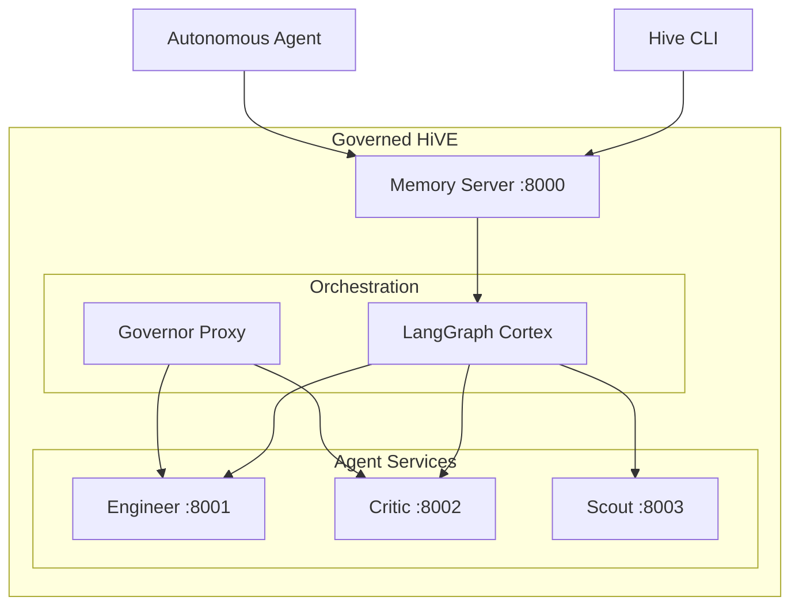

# README.md - Studio Mode

**The Governed HiVE** - An autonomous multi-agent system for software development.

## 🚀 Quick Start

### One-Command Launch (Recommended)
```powershell
# Activate virtual environment and launch entire system
.\.venv\Scripts\Activate.ps1
./start_hive.ps1
```

This starts: Memory Server, Engineer Agent, Critic Agent, Scout Agent, and Orchestrator.

### Manual Launch (Development)
```powershell
# 1. Activate virtual environment
.\.venv\Scripts\Activate.ps1

# 2. Start the Memory Server
python .core/services/memory_server.py

# 3. Start the autonomous agent (in a new terminal)
python .core/lib/autonomous_agent.py --agent-id gemini-cli --model groq/llama-3.1-8b-instant
```

## 🏗️ Architecture



## 📁 Project Structure

```
StudioMode/
├── .core/
│   ├── config/          # Centralized configuration
│   ├── models/          # Shared data models (AgentState, TaskStatus)
│   ├── lib/             # Core libraries
│   │   ├── autonomous_agent.py
│   │   ├── governor.py
│   │   └── memory_client.py
│   └── services/        # Agent services
│       ├── memory_server.py   # Central API (~200 lines)
│       ├── base_service.py    # Agent base class
│       ├── engineer_service.py
│       ├── critic_service.py
│       └── scout_service.py
├── studio-governor/     # React frontend dashboard
├── tests/               # Test suite
├── docs/                # Documentation (see docs/INDEX.md)
└── start_hive.ps1       # One-command system launcher
```

## 🔧 CLI Usage

```powershell
# Check system status
python .core/cli/hive_cli.py status

# Add a task
python .core/cli/hive_cli.py add-task --text "Create a hello world script" --assignee gemini-cli

# List all tasks
python .core/cli/hive_cli.py list-tasks

# Start/Stop the hive
python .core/cli/hive_cli.py start
python .core/cli/hive_cli.py stop
```

## 🧪 Running Tests

```powershell
pytest tests/ -v
```

## 📡 API Endpoints

| Endpoint        | Method | Description              |
| --------------- | ------ | ------------------------ |
| `/`             | GET    | Health check & status    |
| `/state`        | GET    | Get current system state |
| `/tasks/create` | POST   | Create a new task        |
| `/tasks/list`   | GET    | List all tasks           |
| `/tasks/claim`  | POST   | Claim a task             |
| `/memory/add`   | POST   | Add to memory            |
| `/memory/query` | POST   | Query memory             |

## 🔑 Environment Variables

```powershell
$env:GROQ_API_KEY = "your-groq-api-key"
$env:LITELLM_LOG = "DEBUG"  # Optional
```

## 📚 Documentation

See [docs/INDEX.md](docs/INDEX.md) for a guided reading order.

## 📄 License

MIT License - See [LICENSE](LICENSE) for details.
